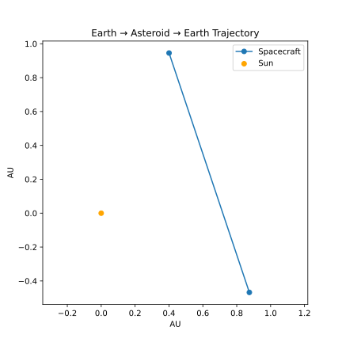
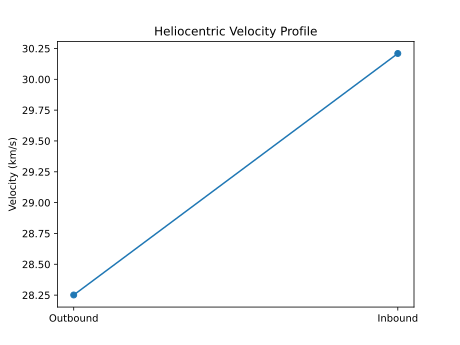

# orbital-mission-sim

# Asteroid Mission Simulator

High-fidelity heliocentric mission simulator for Earth → Asteroid → Earth trajectories with fuel tracking and uncertainty propagation.


## 🚀 Live Mission Visualizations

These plots are automatically generated daily and show the current mission profile:

### Trajectory: Earth → Apophis → Earth


### Fuel Consumption


### Heliocentric Velocity Profile


---

## Features

- **Lambert transfer solver** using Poliastro
- **Rocket equation** fuel consumption tracking
- **Monte Carlo uncertainty propagation** with Polynomial Chaos Expansion
- **Automated visualization** generation via GitHub Actions (updates daily at 02:00 UTC)

## Structure

```
asteroid-mission/
├── simulation/
│   ├── __init__.py
│   └── dynamics.py          # Main simulator with AsteroidMissionSimulator
├── render/
│   ├── trajectory.py        # Trajectory plot generation
│   ├── fuel_plot.py         # Fuel consumption plot
│   └── velocity_plot.py     # Velocity profile plot
├── assets/                  # Generated SVG plots
└── .github/
    └── workflows/
        └── update-mission.yml  # Daily automated updates
```

## Usage

### Run simulations locally:

```bash
# Install dependencies
pip install numpy matplotlib astropy poliastro

# Generate all plots
python render/trajectory.py
python render/fuel_plot.py
python render/velocity_plot.py
```

### Example simulation:

```python
from simulation.dynamics import AsteroidMissionSimulator

sim = AsteroidMissionSimulator(
    epoch_launch="2028-01-01",
    dry_mass_kg=900,
    fuel_mass_kg=600,
    isp_s=320,
    asteroid_name="99942 Apophis"
)

# Execute mission
sim.go_to_asteroid(300)  # 300-day transfer
sim.return_to_earth(300)

# Get final state
print(sim.state())
```

## Mission Parameters

- **Target**: 99942 Apophis
- **Launch**: 2028-01-01
- **Dry Mass**: 900 kg
- **Fuel**: 600 kg
- **ISP**: 320 s
- **Transfer time**: 300 days each way

## Automation

GitHub Actions automatically regenerates visualizations:
- On every push to `main`
- Daily at 02:00 UTC
- Manual trigger via workflow_dispatch

**Important**: Before pushing to GitHub for the first time, generate the initial plots locally:
```bash
python render/trajectory.py
python render/fuel_plot.py
python render/velocity_plot.py
```

See [GITHUB_DEPLOYMENT.md](GITHUB_DEPLOYMENT.md) for complete setup instructions.

## License

MIT